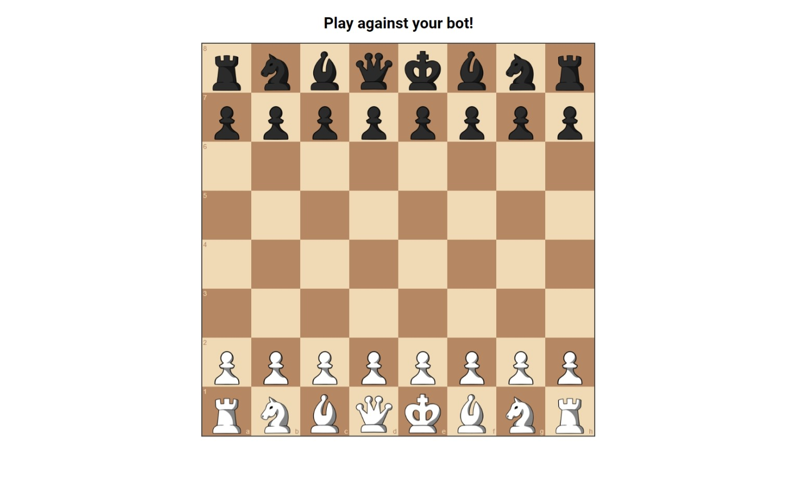

# Getting started

Let's get started. First we are going to need to install the rust compiler. To do that just go to the [Rust website](https://www.rust-lang.org/learn/get-started) and follow the steps.

Now we can download the GitHub repository with the starter code. To do that just open a terminal and:

```bash
git clone https://github.com/TheCaptainCraken/chess-bot-maker
cd chess-bot-maker
```

Now let's try the example bot, run:

```bash
cargo run
```

After the compilation is complete, open your favorite browser and go to [http://localhost:8080](http://localhost:8080). You should see something like this:



>You play as white, the bot plays as black. To move a piece, drag it to the desired square.

The bot is literally playing random moves. The logic for now goes something like:

```plain
moves = get_legal_moves()
next_move = get_random_element(moves)

return next_move
```

You can se the code for this bot in `src/bot.rs`. Open it with your favorite text editor:

```rust
use rand::seq::SliceRandom;
use shakmaty::{Chess, Move, Position};

pub fn next_move(position: &Chess) -> Move {
    let legal_moves = position.legal_moves();

    let bot_move = legal_moves.choose(&mut rand::thread_rng()).unwrap();

    bot_move.clone()
}
```

For us, creating a bot is as simple as returning a valid move from `next_move`. Here we are asking shakmaty to generate all the legal moves from our current position. Then we are using the `rand` crate to choose a random move and we return it.

This bot is not the brightest but it can at least play a full game of chess. In the next chapters we'll work on choosing better and better moves.

## What is going on with the rest of the code?

If you' re curious about how everything works behind the scenes, here's a quick tour.

The entry point for our application is `src/main.rs`, here we create a web server using [actix web](https://actix.rs/):

```rust
use actix_files as fs;
use actix_web::{get, web, App, HttpServer, Result};
use shakmaty::{fen::Fen, CastlingMode, Chess, Position};

mod bot;

#[actix_web::main]
async fn main() -> std::io::Result<()> {
    println!("Starting test game @ http://localhost:8080");
    HttpServer::new(|| {
        App::new()
            .service(bot_move)
            .service(fs::Files::new("/", "./static/").index_file("index.html"))
    })
    .bind(("127.0.0.1", 8080))?
    .run()
    .await
}
```

This new app has two services. The first is called `bot_move`, the code for it is:

```rust
#[get("/bot-move/{fen}")]
async fn bot_move(path: web::Path<String>) -> Result<String> {
    let data = path.into_inner();

    let fen: Fen = data
        .replace("%2F", "/")
        .replace("%20", " ")
        .parse()
        .unwrap();

    let position: Chess = fen.into_position(CastlingMode::Standard).unwrap();

    let bot_move = bot::next_move(&position);

    let new_position = position.play(&bot_move).unwrap();

    let fen_string = format!(
        "{}",
        Fen::from_position(new_position, shakmaty::EnPassantMode::Always)
    );
    Ok(fen_string)
}
```

This is an API endpoint which receives a [FEN](https://www.chessprogramming.org/Forsyth-Edwards_Notation) formatted string. It then loads it into shakmaty to create a `Chess` struct. Then it calls `next_move` (our code from earlier), plays the move and prints the resulting position to a string in FEN notation. This is sent back to the user of the API.

The second service is a simple static file web server, it serves all the files in the `static` folder. It contains:

```plain
static/
├── pieces/
├── index.html
├── index.js
└── style.css
```

- The `pieces` folder contains custom pieces made by  [Paula Bellesi Torralba](https://github.com/kbx12).
- `index.html` just renders a div and the title you see on the page.
- `index.js` uses [chessboard.js](https://www.chessboardjs.com/) to create the chess board and controls it. It also calls our api from earlier to get the moves for the bot.
- `style.css` just imports a font for the title and aligns everything on the page.
