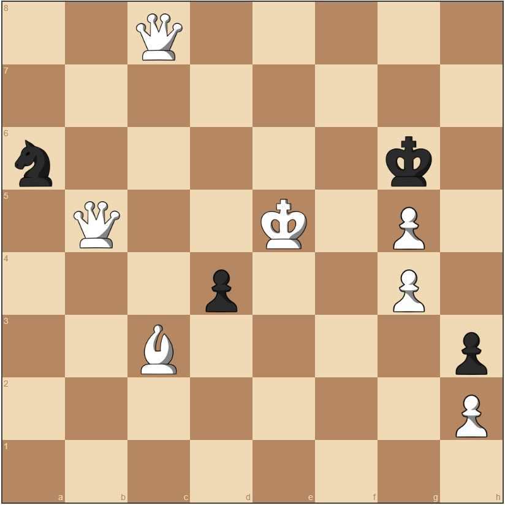

# Basic evaluation

Alright, let's improve this evaluation function!

Currently we are:

1. Generating all the legal moves
2. Picking one at random

Not really Grandmaster worthy. We can do better. We need a way to find the best move we have.

One way is to evaluate each move by checking if it leads to a better or worse position for us.
This means assessing if we're winning or losing in any given game state.
Unfortunately, there is no way to do it perfectly, since chess is a very complex game.

## Piece counting

A dead simple, easy-peasy method to evaluate a position is counting the number of pieces:

- We have a lot of pieces = good
- Enemy has few pieces = good

We can bring this further. Not all pieces are created equal: a queen is way stronger (and more valuable) than a pawn!
We can assign each piece a score and then calculate the total for both players by counting pieces and multiplying by scores.

These are the most common scores assigned to pieces:

| piece  | score |
|--------|-------|
| pawn   | 1     |
| bishop | 3     |
| knight | 3     |
| rook   | 5     |
| queen  | 9     |
| king   | 0     |

Let's look at an example:



Let's say we are white here, we have:

- 1 king
- 3 pawns
- 1 bishop
- 2 queens

This makes our score: \\(1  \cdot 0 + 3 \cdot 1 + 1  \cdot 3 + 2 \cdot 9 = 24\\).

Black has:

- 1 king
- 2 pawns
- 1 knight

This makes their score: \\( 1 \cdot 0 + 2 \cdot 1 + 1  \cdot 3 = 5 \\). The total score for this position is \\( 24 - 5 = 19 \\) we are winning by \\(19\\) points! Yay!

>**Side note for the curious**: the king has a score of \\(0\\), this is because we are only going to analyze legal positions so there will always be a king thus no score needed.

### Implementation

Let's start with the piece counting function:

```pseudo
function count_pieces(position){
    scores = {
        pawn = 1
        bishop = knight = 3
        rook = 5
        queen = 9
        king = 0
    }

    white_score = count(position.board.white, king) * scores.king + count(position.board.white, pawn) * scores.pawn ...

    black_score = ...

    return white_score - black_score
}
```

Then we use it to calculate the best possible move:

```pseudo
function next_move(position){
    legal_moves = get_legal_moves(position)
    best_move = null
    best_score = -infinity

    for(move in legal_moves){
        new_position = position.play(move)
        score = count_pieces(new_position)
        if(score > best_score){
            best_score = score
            best_move = move
        }
    }
}
```

Now, let's check out some Rust code. We'll start with some helper functions:

```rust
fn is_opponent(piece_color: Color, our_color: Color) -> i64 {
    if piece_color == our_color {
        1
    } else {
        -1
    }
}
```

This function returns \\(1\\) if the piece is ours and \\(-1\\) if it isn't. We'll use this to know if we need to add or subtract a piece's score based on its color.

```rust
fn get_score(role: Role) -> i64 {
    match role {
        Role::Pawn => 1,
        Role::Knight => 3,
        Role::Bishop => 3,
        Role::Rook => 5,
        Role::Queen => 9,
        Role::King => 0,
    }
}
```

This function just returns for each piece, the score associated with it, the scores are the same as before.

```rust
fn evaluate(position: &Chess) -> i64 {
    /*
        This is using iterative folding to calculate the evaluation of the position.
        The evaluation is calculated by iterating over the pieces on the board and summing up the score of each piece.
        The score of each piece is calculated by multiplying the count of the piece by the score of the piece and then taken positively or negatively based on the color of the piece.
    */
    let score = position
        .board()
        .material()
        .zip_color()
        .iter()
        .fold(0, |acc, (color, pieces)| {
            acc + pieces.zip_role().iter().fold(0, |acc, (role, count)| {
                let score = get_score(*role)
                    * (*count as i64)
                    * is_opponent((*color).other(), position.turn()); // we have to invert the color because by playing the move we are changing the turn.
                acc + score
            })
        });

    score
}
```

Now, we're doing something interesting: this function takes the board, iterates over every piece, calculates its value and adds everything together.
Our pieces are added while enemy pieces are subtracted. Then, we return the score.

```rust
pub fn next_move(position: &Chess) -> Move {
    let legal_moves = position.legal_moves(); // Get all legal moves

    // Find the move that maximizes the evaluation (piece count)
    let best_move = legal_moves
        .iter()
        .max_by_key(|legal_move| {
            let new_position = position.clone().play(legal_move).expect("Move is legal");
            let evaluation = evaluate(&new_position);
            evaluation
        })
        .expect("No legal moves found");

    best_move.clone()
}
```

Here we use `evaluate()` to find the move leading to the most favorable state. Then we return that move.
If there is more than one move with the best value, we just return the first.

### Let's try it

Run the program and see how the engine is doing.

- Is it capturing pieces as soon as it can?
- Is it choosing the highest value piece if it has a choice?

If it isn't, check out my code. You can find it in `src/examples/basic_evaluation.rs`.
The most common mistake here is to add what should be subtracted and viceversa.

### Conclusion

Now our little engine is finally choosing moves on its own and it tries go get ahead! Yay!
Slight problem, the bot is now playing like an [angry goose](https://youtu.be/AMdhAFPWzFw?si=dNB94WBqWfwzW4no&t=13).
It tries to kill everything it can, regardless of what is going to happen in the next moves. This isn't the tactical wisdom we are looking for.

In the next section we'll be looking at how to make our little duck think before acting using one of my favorites algorithms ever: Minimax.
